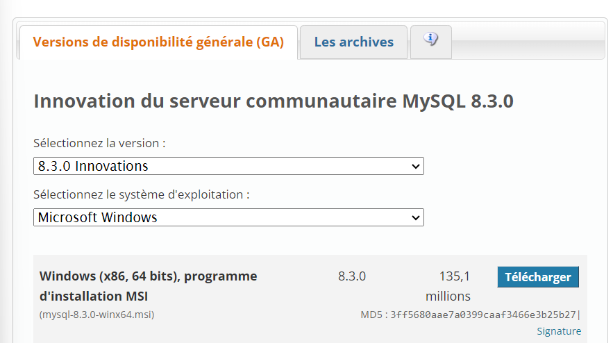
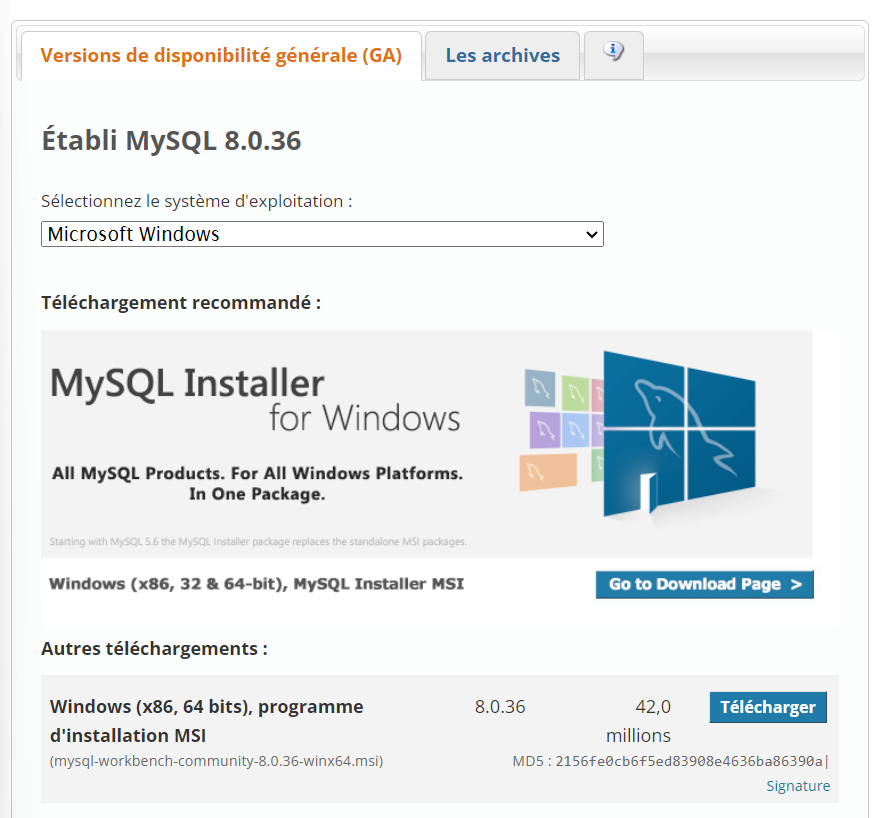
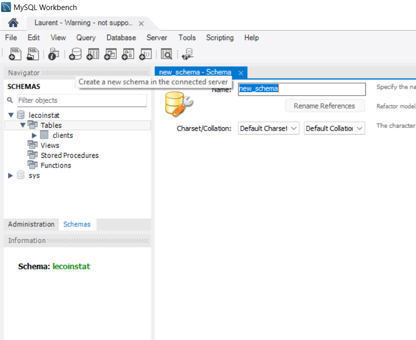

# [MYSQL](https://www.youtube.com/watch?v=LRjnjipMe54&list=PLyh35eYRez8cAEBfi1LWN70Cs77bBvCOp)

Pour bien démarrer avec MySQL, il faut procéder aux étapes suivantes :

- Étape 1 : [installer MySQL Community Server](https://dev.mysql.com/downloads/mysql/)

- Étape 2 : [installer MySQL Workbench](https://dev.mysql.com/downloads/workbench/) (permet de ne pas passer par des lignes pour effectuer des requêtes SQL)

Dans le workbench, pour chaque nouvelle base de données à requêter, aller sur l'icône suivant ("Create a new schema in the connected server") :

Avant d'importer les données d'un fichier .csv, il faut préalablement créer les en-têtes des colonnes par une requête SQL : voir le fichier index001_CreateTable à titre d'exemple, et suivre les indications mentionnées dans ce fichier

Date : 16-03-2024
